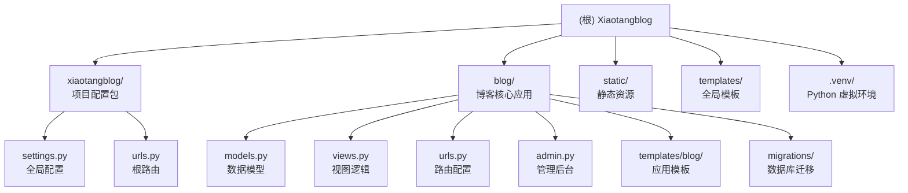

# 小唐博客 (Xiaotangblog) - 项目文档

## 变更记录 (Changelog)

| 版本 | 日期 | 说明 |
|------|------|------|
| 0.1.0 | 2026-03-16 | 初始架构文档生成（项目目录为空，基于参考目录结构与 CSS 资源推断） |

---

## 项目愿景

小唐博客 (Xiaotangblog) 是一个基于 Python/Django 框架构建的个人博客系统。项目目标是提供一个简洁、美观、易于维护的内容发布平台，支持文章管理、分类展示、搜索等核心博客功能。

**当前状态：** 项目目录已创建但尚未初始化源代码。参考环境位于同级目录 `../Django/djangoProject`（已配置 `.venv` 虚拟环境与 Django 5.1.3、SQLite 数据库及博客静态资源）。

---

## 架构总览

本项目采用标准 Django MVT（Model-View-Template）架构：

- **语言：** Python 3.x
- **框架：** Django 5.1.3（推断自参考环境）
- **数据库：** SQLite（开发阶段），可迁移至 PostgreSQL/MySQL
- **前端：** Django 模板引擎 + 原生 HTML/CSS
- **静态资源：** Django `staticfiles` 管理

### 预期目录结构

```
Xiaotangblog/           # 项目根目录
├── manage.py           # Django 管理脚本（待创建）
├── requirements.txt    # 依赖清单（待创建）
├── db.sqlite3          # SQLite 数据库（运行后自动生成）
├── xiaotangblog/       # Django 项目配置包（待创建）
│   ├── settings.py     # 全局配置
│   ├── urls.py         # 根路由
│   ├── wsgi.py         # WSGI 入口
│   └── asgi.py         # ASGI 入口
├── blog/               # 博客核心应用（待创建）
│   ├── models.py       # 数据模型（文章、分类、标签等）
│   ├── views.py        # 视图逻辑
│   ├── urls.py         # 应用路由
│   ├── admin.py        # 管理后台注册
│   ├── templates/      # 模板文件
│   └── migrations/     # 数据库迁移
├── static/             # 静态资源
│   ├── css/            # 样式表
│   └── images/         # 图片资源
└── .venv/              # Python 虚拟环境（待创建）
```

---

## 模块结构图



---

## 模块索引

| 模块路径 | 职责描述 | 状态 | 文档 |
|----------|----------|------|------|
| `xiaotangblog/` | Django 项目配置包（settings、urls、wsgi） | 待创建 | [CLAUDE.md](./xiaotangblog/CLAUDE.md) |
| `blog/` | 博客核心应用（文章、分类、标签、视图、模板） | 待创建 | [CLAUDE.md](./blog/CLAUDE.md) |
| `static/` | 全局静态资源（CSS、JS、图片） | 待创建 | - |
| `templates/` | 全局 Django 模板（base.html 等） | 待创建 | - |

---

## 运行与开发

### 环境初始化

```bash
# 1. 进入项目目录
cd Xiaotangblog

# 2. 创建虚拟环境
python -m venv .venv

# 3. 激活虚拟环境（Windows）
.venv\Scripts\activate

# 4. 安装依赖
pip install django

# 5. 初始化 Django 项目（如尚未创建）
django-admin startproject xiaotangblog .
django-admin startapp blog

# 6. 执行数据库迁移
python manage.py migrate

# 7. 创建管理员账户
python manage.py createsuperuser

# 8. 启动开发服务器
python manage.py runserver
```

### 常用命令

```bash
# 创建迁移文件
python manage.py makemigrations

# 应用迁移
python manage.py migrate

# 收集静态文件（生产环境）
python manage.py collectstatic

# 进入 Django shell
python manage.py shell

# 运行测试
python manage.py test
```

### 参考环境

同机器上已有运行环境位于：`../Django/djangoProject`
- 虚拟环境：`.venv/`（已安装 Django 5.1.3、sqlparse 0.5.2、asgiref 3.8.1）
- 数据库：`db.sqlite3`（SQLite）
- 样式资源：`static/new_blah.css`（博客界面样式）

可直接复用该环境的 `requirements.txt` 或 `.venv/Lib/site-packages/Django-5.1.3.dist-info` 中的包版本信息。

---

## 测试策略

| 类型 | 工具 | 路径 | 说明 |
|------|------|------|------|
| 单元测试 | Django TestCase | `blog/tests.py` | 模型、视图、URL 的单元测试 |
| 集成测试 | Django Client | `blog/tests.py` | HTTP 请求/响应层测试 |
| 管理后台测试 | Django TestCase | `blog/tests.py` | Admin 注册与权限测试 |

**推荐命令：**
```bash
python manage.py test blog
python manage.py test --verbosity=2
```

---

## 编码规范

### Python 规范
- 遵循 **PEP 8** 代码风格
- 使用 4 空格缩进（禁止 Tab）
- 每行最大长度：**88 字符**（兼容 Black 格式化工具）
- 函数与类均需编写 docstring

### Django 规范
- 模型字段须标注 `verbose_name`，方便管理后台显示
- 视图优先使用**基于类的视图（Class-Based Views）**
- URL 须命名（`name=` 参数），模板中使用 `` 引用
- 静态文件使用 `` 模板标签引用

### 提交规范
```
feat: 新增文章列表分页功能
fix: 修复分类过滤 SQL 查询错误
docs: 更新 CLAUDE.md 安装说明
style: 格式化 views.py 代码风格
refactor: 重构文章查询逻辑
test: 新增文章模型单元测试
```

---

## 关键配置与环境信息

### 推荐 requirements.txt

```
Django>=5.1.3
Pillow>=10.0.0          # 如需图片处理
django-crispy-forms     # 如需美化表单（可选）
```

### settings.py 关键配置项

```python
# 推荐开发配置
DEBUG = True
ALLOWED_HOSTS = ['localhost', '127.0.0.1']

INSTALLED_APPS = [
    'django.contrib.admin',
    'django.contrib.auth',
    'django.contrib.contenttypes',
    'django.contrib.sessions',
    'django.contrib.messages',
    'django.contrib.staticfiles',
    'blog',  # 博客应用
]

DATABASES = {
    'default': {
        'ENGINE': 'django.db.backends.sqlite3',
        'NAME': BASE_DIR / 'db.sqlite3',
    }
}

STATIC_URL = '/static/'
STATICFILES_DIRS = [BASE_DIR / 'static']
MEDIA_URL = '/media/'
MEDIA_ROOT = BASE_DIR / 'media'
```

---

## AI 使用指引

在使用 AI 工具（如 Claude）辅助开发本项目时，请注意：

1. **优先读取 CLAUDE.md：** 每次开始新任务前，先告知 AI 本文件的内容，确保上下文一致。
2. **模型修改：** 修改 `blog/models.py` 后，务必执行 `makemigrations` 和 `migrate`。
3. **安全事项：** `settings.py` 中的 `SECRET_KEY` 不应提交至版本控制，应使用环境变量管理。
4. **测试优先：** 新增功能前，建议先让 AI 生成对应测试用例。
5. **本文档为唯一文档源：** 代码变更后，需同步更新对应模块的 `CLAUDE.md`。
